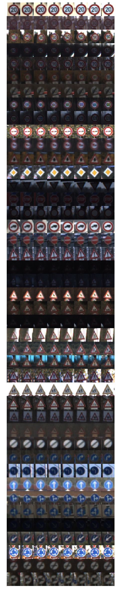
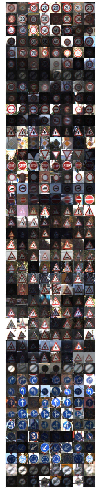
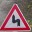

# **Traffic Sign Recognition** 

## Writeup

**Build a Traffic Sign Recognition Project**

The goals / steps of this project are the following:

* Load the data set (see below for links to the project data set)
* Explore, summarize and visualize the data set
* Design, train and test a model architecture
* Use the model to make predictions on new images
* Analyse the softmax probabilities of the new images
* Summarize the results with a written report

## Rubric Points
### Here I will consider the [rubric points](https://review.udacity.com/#!/rubrics/481/view) individually and describe how I addressed each point in my implementation.  

---
### Writeup / README

#### 1. Provide a Writeup / README that includes all the rubric points and how you addressed each one. You can submit your writeup as markdown or pdf. You can use this template as a guide for writing the report. The submission includes the project code.

You're reading it! and here is a link to my [project code](https://github.com/LinasKo/CarND-Traffic-Sign-Classifier-Project/blob/master/notebooks/Traffic_Sign_Classifier.ipynb)

### Data Set Summary & Exploration

#### 1. Provide a basic summary of the data set. In the code, the analysis should be done using python, numpy and/or pandas methods rather than hardcoding results manually.

I used the numpy library to calculate summary statistics of the traffic signs data set:

* The size of training set is **34799**
* The size of the validation set is **4410**
* The size of test set is **12630**
* The shape of a traffic sign image is **(32, 32, 3)** (or **(1, 32, 32, 3)** if you consider it a tensor)
* The number of unique classes/labels in the data set is **43**

#### 2. Include an exploratory visualization of the dataset.

Here is an exploratory visualization of the data set. From my experience, it is most important to gain a general understanding of the dataset first. Therefore, I visualised several examples of all traffic sign classes. I carried out two different visualisations:

* The first 8 images of each traffic sign class
* 8 random images of each class

<figure>
	

		
		
		<figcaption>First 8 and Random 8 examples of each traffic sign class</figcaption>
	

</figure>

This tells me that:

* There are many very similar examples of particular traffic signs. This means that the dataset is equivalent to a much smaller one, with added deformations / other augmentation. This will likely introduce bias and reduce training results, compared to a dataset consisting of completely unique images.
* Running the second visualisation several times shows that for the majority of classes, there is a good variation of signs in the dark and signs in the light. The exact variation is unknown, but at least it doesn't seem that I should prioritize deeper investigations yet.

### Design and Test a Model Architecture

#### 1. Describe how you preprocessed the image data. What techniques were chosen and why did you choose these techniques? Consider including images showing the output of each preprocessing technique. Pre-processing refers to techniques such as converting to grayscale, normalization, etc. (OPTIONAL: As described in the "Stand Out Suggestions" part of the rubric, if you generated additional data for training, describe why you decided to generate additional data, how you generated the data, and provide example images of the additional data. Then describe the characteristics of the augmented training set like number of images in the set, number of images for each class, etc.)

In fact, I have decided to not use any preprocessing:

* No normalization has been carried out as I wanted to see the results without it.
* Images were not converted to grayscale since traffic signs contain useful color information, at the very least significantly humans in recognizing them.
* No other data augmentation has been carried out. That could include, for example: zooming, panning, skewing, blurring or affine deformations. I would most likely avoid flipping since traffic signs are oriented in a specific direction and for some classes, flipping it actually changes the sign class.

#### 2. Describe what your final model architecture looks like including model type, layers, layer sizes, connectivity, etc.) Consider including a diagram and/or table describing the final model.

The architecture I initially devised and ultimately ended up using was the LeNet architecture, presented to us in the "LeNet for Traffic Signs" class:

| Layer         		|     Description	        					| 
|:---------------------:|:---------------------------------------------:| 
| Input         		| 32x32x3 RGB image   							| 
| Convolution 5x5, k=6  | 1x1 stride, same padding, outputs 28x28x6 	|
| RELU					|												|
| Max pooling	      	| 2x2 stride, outputs 14x14x6 				    |
| Convolution 5x5, k=16 | 1x1 stride, same padding, outputs 10x10x16 	|
| RELU					|												|
| Max pooling	      	| 2x2 stride, outputs 5x5x6 				    |
| Fully connected       | 120 hidden units								|
| RELU					|												|
| Fully connected       | 84 hidden units								|
| RELU					|												|
| Fully connected       | 43 hidden units								|
| Softmax				|             									|

#### 3. Describe how you trained your model. The discussion can include the type of optimizer, the batch size, number of epochs and any hyperparameters such as learning rate.

Most of the hyperparameters for training were kept as in the example:

* Learning rate was **0.001**
* Adam optimizer was used to update the learning rate
* No dropout was used - with it, the results would definitely be much better

However:

* I have trained for 100 epochs
* The batch size was set to 256
* Most importantly, instead of using the random variable initialization and zero bias as initial weights, I initialized the weights using Xavier-Glorot initialization [Original Paper](http://proceedings.mlr.press/v9/glorot10a/glorot10a.pdf). It takes into account the number of input and output neurons, connected to each layer.

#### 4. Describe the approach taken for finding a solution and getting the validation set accuracy to be at least 0.93. Include in the discussion the results on the training, validation and test sets and where in the code these were calculated. Your approach may have been an iterative process, in which case, outline the steps you took to get to the final solution and why you chose those steps. Perhaps your solution involved an already well known implementation or architecture. In this case, discuss why you think the architecture is suitable for the current problem.

My final model results were:

* validation set accuracy of **0.935**
* test set accuracy of **0.919**

A trial-and-error approach was chosen. I have decided to create a baseline using an example from the lectures and make some improvements to it that I consider trivial. After measuring the validation accuracy after 20 epochs, I have decided to let it run for a 100. This results in a fluctuating validation accuracy, but with 100 epochs, it consistently provides 1-5 cases reaching 0.93.

Now, since my approach was very basic, here's what I can easily do to further improve my results, mine were less satisfying (more or less, the most significant ones first):

* Preprocess by normalizing the images
* Add dropout layers with keep rate of 0.7 for convolutional layers and 0.5 for densely connected layers. I can't fully recall, where, but there was a paper stating that these values work the best.
* Data augmentation - as mentioned before: zooming, panning, skewing, blurring or affine deformations.
* Deepen the network / increase filter sizes for convolutional layers.
* Analyse distributions of lighting conditions in the dataset. Are we sure that each sign has been photographed in diverse lighting? If not, we might be learning the surroundings instead of the sign.

### Test a Model on New Images

#### 1. Choose five German traffic signs found on the web and provide them in the report. For each image, discuss what quality or qualities might be difficult to classify.

Here are five German traffic signs that I found on the web:

<figure>
	

		
		
		
		
		
		<figcaption>Here are the 5 German traffic signs that I used to test my network</figcaption>
	

</figure>

As you can see, the third sign is almost fully covered in snow. However, interestingly enough, my network correctly classified all 5 signs, except for the second one, which was seen as 'Beware of ice/snow' (30) sign. Interesting indeed, if not a bit ironic.

#### 2. Discuss the model's predictions on these new traffic signs and compare the results to predicting on the test set. At a minimum, discuss what the predictions were, the accuracy on these new predictions, and compare the accuracy to the accuracy on the test set (OPTIONAL: Discuss the results in more detail as described in the "Stand Out Suggestions" part of the rubric).

Here are the results of the prediction:

| Image					|	Prediction									| 
|:---------------------:|:---------------------------------------------:| 
| Priority Road			| Priority Road									| 
| Double curve			| Beware of ice/snow							|
| Road work				| Road work										|
| Traffic signals		| Traffic signals								|
| Turn right ahead		| Turn right ahead								|

The model was able to correctly guess 4 of the 5 traffic signs, which gives an accuracy of 80%. This actually returns a lower accuracy than the test set accuracy of 0.919.

#### 3. Describe how certain the model is when predicting on each of the five new images by looking at the softmax probabilities for each prediction. Provide the top 5 softmax probabilities for each image along with the sign type of each probability. (OPTIONAL: as described in the "Stand Out Suggestions" part of the rubric, visualizations can also be provided such as bar charts)

The code for making predictions on my final model is located at the end of my notebook.

Interestingly enough, the model seems to be very certain of its choices. I wonder if the large number of epochs has managed to saturate neurons of the network, providing very strong bias towards certain classes once several features are detected. (I am not 100% certain that it would work this way.). A bit of L2 regularization might help with this. Still, the performance of the network seems to be good.

Ultimately, here are the top five guesses of the network along with the corresponding Softmax Cross-entropy scores (As given out by TensorFlow):

| Probability         	|     Prediction (Actual Sign: Priority Road)				| 
|:---------------------:|:---------------------------------------------------------:			| 
| 1.00000000e+00         			| Priority Road									| 
| 0.00000000e+00     				| Speed limit (20km/h)							|
| 0.00000000e+00					| Speed limit (30km/h)							|
| 0.00000000e+00	      			| Speed limit (50km/h)	 						|
| 0.00000000e+00				    | Speed limit (60km/h)     						|

| Probability         	|     Prediction (Actual Sign: Double curve)				| 
|:---------------------:|:---------------------------------------------:			| 
| 1.00000000e+00         			| Beware of ice/snow 							| 
| 6.05858939e-12     				| Right-of-way at the next intersection			|
| 1.25067409e-22					| Children crossing								|
| 4.94109686e-23	      			| Slippery road		 							|
| 1.08968804e-23				    | Road narrows on the right      				|

| Probability         	|     Prediction (Actual Sign: Road work) 					| 
|:---------------------:|:---------------------------------------------:			| 
| 1.00000000e+00         			| Road work   									| 
| 7.82300960e-12     				| No passing for vehicles over 3.5 metric tons	|
| 1.10977497e-21					| Speed limit (30km/h)							|
| 2.20201245e-22	      			| Ahead only		 							|
| 8.16160857e-23				    | Right-of-way at the next intersection      	|

| Probability         	|     Prediction (Actual Sign: Traffic signals)				| 
|:---------------------:|:---------------------------------------------:			| 
| 1.00000000e+00        			| Traffic signals   							| 
| 1.60755664e-09     				| General caution								|
| 3.37621730e-28					| Dangerous curve to the right					|
| 2.19155480e-29	      			| Speed limit (30km/h)		 					|
| 0.00000000e+00				    | Speed limit (20km/h)      					|

| Probability         	|     Prediction (Actual Sign: Turn right ahead)			| 
|:---------------------:|:---------------------------------------------:			| 
| 9.99978065e-01         			| Turn right ahead   							| 
| 2.18854257e-05     				| Roundabout mandatory							|
| 4.94099847e-19					| Ahead only									|
| 6.36726972e-22	      			| Keep right		 							|
| 2.25456350e-27				    | Speed limit (80km/h)      					|

### (Optional) Visualizing the Neural Network (See Step 4 of the Ipython notebook for more details)
#### 1. Discuss the visual output of your trained network's feature maps. What characteristics did the neural network use to make classifications?

Because of the lack of time, I did not carry out the optional task this time.
